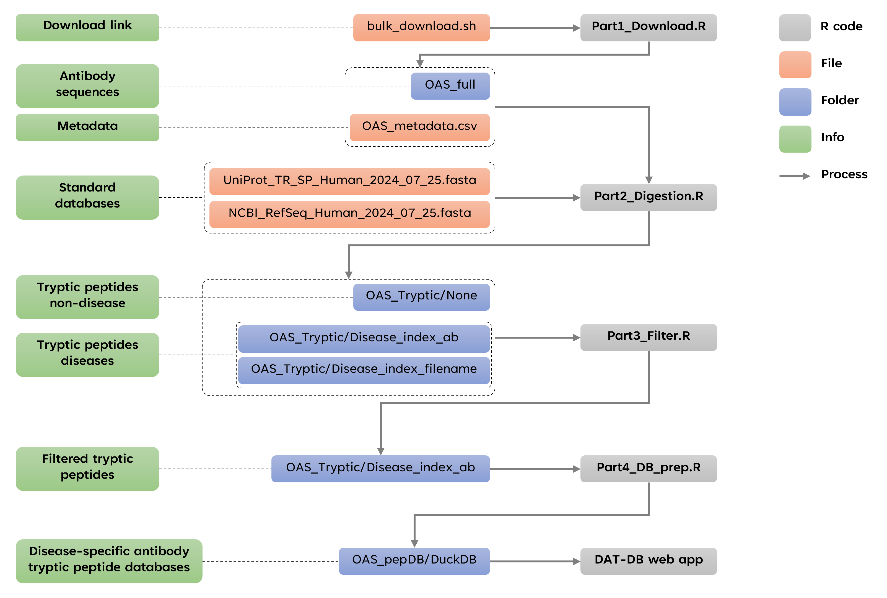

# Data mining antibody sequences for database searching in bottom-up proteomics

## 0. Introduction

Human antibodies, vital components of the immune system, are protein molecules composed of two heavy and two light polypeptide chains, interconnected by disulfide bonds. These antibodies play a critical role in immune defense by recognizing and neutralizing pathogens. Identifying disease-specific antibodies is essential for diagnosing infectious diseases, evaluating vaccine effectiveness, and determining an individual's immune status. However, the human body can produce billions of unique antibodies, making their identification in complex biological samples, such as blood plasma, a considerable challenge.

Mass spectrometry (MS)-based proteomics is a powerful method for identifying and quantifying antibodies. Among the various MS approaches, bottom-up proteomics is especially effective for analyzing thousands of antibodies in complex mixtures. In this method, proteins are enzymatically digested into smaller peptides, typically using the protease trypsin, which are then analyzed via mass spectrometry. These peptides are matched to sequences in standard databases like UniProt or NCBI-RefSeq for identification.

However, a major limitation of this approach is the absence of comprehensive disease-specific antibody databases. Current databases, such as UniProt, include only a fraction of the antibody sequences present in the human body. For instance, as of January 2024, UniProt contains just 38,800 immunoglobulin sequences, far short of the billions of antibodies the human immune system can produce. As a result, relying on such limited databases can lead to under-detection of antibodies, particularly those associated with specific diseases. Expanding antibody databases with disease-specific sequences is crucial for improving the accuracy of MS-based proteomics in identifying antibodies relevant to human health.

Recently, through next-generation sequencing of antibody gene repertoires, it has become possible to obtain billions of antibody sequences (in amino acid format) by annotating, translating, and numbering antibody gene sequences. These large numbers of sequences are now available in public databases such as the [Observed Antibody Space](https://opig.stats.ox.ac.uk/webapps/oas/). We hypothesize that using these theoretical antibody sequences as new databases for bottom-up proteomics could address the current lack of antibody coverage in standard databases.

The workflow below is for creating disease-specific antibody tryptic peptide databases to use in bottom-up proteomics. The workflow contains five steps: **Download**, **Digest**, **Filter**, **Prepare DB** and **Use results for web app**. For the first four steps, four R script files were prepared and used for each step, those files are available in `Databases-preparation` directory (`Part1_Download.R`, `Part2_Digestion.R`, `Part3_Filter.R`, `Part4_DB_prep.R`).

Before starting the workflow, we need to install necessary R packages by running the codes in the file `Part0_Install_Packages.R` in the `Databases-preparation` directory.

## 1. Download antibody sequence data

Firstly, human antibody sequences are downloaded from [Observed Antibody Space webpage](https://opig.stats.ox.ac.uk/webapps/oas/). Go to the website, choose **Unpaired Sequences**. In the box **Search OAS sequences by attribute**, choose Species: **human**, Chain: **heavy**, and click **Search**. Heavy chain is capable of generating much more junctional and combinatorial diversity than the light chain and is the major contributor to antigen binding [(Tizard 2023)](http://dx.doi.org/10.1016/B978-0-323-95219-4.00013-7). Therefore, heavy chains in unpaired sequences were focused. The search will yield **1,891,061,809** unique sequences from **69** studies as of September 2024. A shell-script with the commands to download all the antibody data files in this search will be available for download, this file is `bulk_download.sh`.

Next, after getting the `bulk_download.sh` file, we open the `Part1_Download.R` file and run R codes in it. This file will use links in `bulk_download.sh` file to download antibody data and their metadata. After finish running codes in this file, a metadata file named `OAS_metadata.csv` and a directory `OAS_full` containing 13,265 `csv.gz` files of antibody will be obtained. Each file in `OAS_full` directory is a data table with columns: `sequence_alignment_aa`, `v_call`, `d_call`, `j_call`, `cdr1_aa`, `cdr2_aa`, `cdr3_aa`, where `sequence_alignment_aa` is antibody sequence in amino acid format, `v_call`, `d_call`, `j_call` are V call, D call and J call of antibody, `cdr1_aa`, `cdr2_aa`, `cdr3_aa` are peptide sequences in amino acid format of CD1, 2, 3 regions of the antibody.

For downloading 1.89 billion antibody sequences, this process will take about 5h using a computer with CPU of Intel Xeon Gold 6130 and RAM of 48 GB.

## 2. Digest antibody sequences data

After part 1, OAS_full directory and OAS_metadata.csv file are obtained. We will used the `Part2_Digestion.R` to digest the antibody sequences in OAS_full directory along with human protein sequences from standard databases ([UniProt](https://www.uniprot.org/) and [NCBI-RefSeq](https://ftp.ncbi.nlm.nih.gov/refseq/H_sapiens/mRNA_Prot/)). Here, we have UniProt and NCBI-RefSeq obtained from July 2024 (files: `UniProt_TR_SP_Human_2024_07_25.fasta` and `NCBI_RefSeq_Human_2024_07_25.fasta` in `Databases-preparation` directory).

The digestion was done by using package cleaver from Bioconductor, with settings: `enzym="trypsin", missedCleavages=0:1`. This will collect tryptic peptides with missed cleavages of 0 and 1. After digestion of both antibody and protein sequences, we keep only antibody tryptic peptides that are not ovelapping with tryptic peptides from UniProt and NCBI-RefSeq.

Output of this part 2 is tryptic peptides of non-disease and disease samples storing in three directories. Directory `OAS_Tryptic/None` contains tryptic peptides of non-disease samples. Directory `OAS_Tryptic/Disease_index_ab` contains tryptic peptides of disease samples with two columns: Sequence and Antibody, where Sequence is tryptic peptide and Antibody is the antibody containing that peptide. Directory `OAS_Tryptic/Disease_index_filename` contains tryptic peptides of disease samples with two columns: Sequence and Filename, where Sequence is tryptic peptide and Filename is the file name of the data. This Filename will be map to metadata (OAS_metadata.csv) to get information of: B-cell source, B-cell-type, antibody isotype, patient, disease.

For digestion of 1.89 billion antibody sequences, this process will take about 7 days using a computer with CPU of Intel Xeon Gold 6130 and RAM of 384 GB.

## 3. Filter tryptic peptide data

In this part, we will use `Part3_Filter.R` to filter tryptic peptides of one disease by removing the peptides overlapping with the peptides in non-disease samples and the peptides in other disease samples in order to obtain **disease-specific antibody tryptic peptides**. The filtered tryptic peptides of all 24 diseases are resulted in directory `OAS_Tryptic/Disease_index_ab`.

For filtering the data in this workflow, this process will take about 48h using a computer with CPU of Intel Xeon Gold 6130 and RAM of 192 GB.

## 4. Create databases

After obtaining **disease-specific antibody tryptic peptides**, we will use `Part4_DB_prep.R` to create database files for later querying based on metadata such as: B-cell source, B-cell-type, antibody isotype, patient, disease. We will use DuckDB database format instead of SQL database format because DuckDB is much faster and more storage-optimized than SQL. After running the R codes, the database files (`.duckdb` extension) will be stored in directory `OAS_pepDB/DuckDB`. We made those database available at [Zenodo](https://doi.org/10.5281/zenodo.10561456).

## 5. Web application

Using those database files above, we made DAT-DB - a web application for researchers to get FASTA files of disease-specific antibody peptides for direct use in bottom-up proteomics. A demo version of the app is available at this [DAT-DB link](https://trinhxt.shinyapps.io/DAT-DB/).
