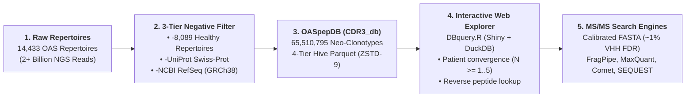
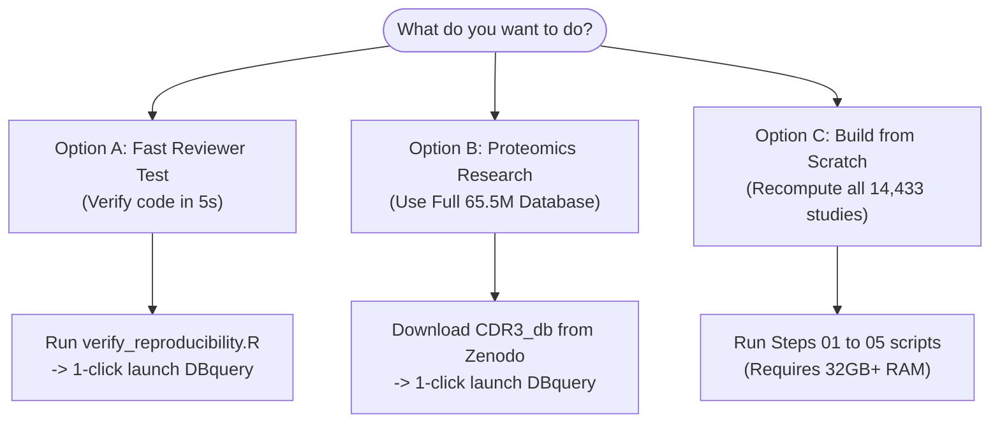

# OASpepDB: Human Disease CDR3 Antibody Peptides Database

[](LICENSE)
[](https://www.r-project.org/)
[](https://www.python.org/)
[](https://duckdb.org/)
[](https://doi.org/10.5281/zenodo.10561456)

A curated repository of **65,510,795** non-redundant, **disease-associated antibody CDR3 peptides** across **25 human disease cohorts**, engineered specifically for bottom-up immunoproteomics and liquid chromatography–tandem mass spectrometry (LC-MS/MS) database searching.

---

## 1. How OASpepDB was built


```mermaid
flowchart LR
    A["<b>1. Raw Repertoires</b><br/>14,433 OAS Repertoires<br/>(2+ Billion NGS Reads)"] --> B["<b>2. 3-Tier Negative Filter</b><br/>• -8,089 Healthy Repertoires<br/>• -UniProt Swiss-Prot<br/>• -NCBI RefSeq (GRCh38)"]
    B --> C["<b>3. OASpepDB (CDR3_db)</b><br/>65,510,795 Neo-Clonotypes<br/>4-Tier Hive Parquet (ZSTD-9)"]
    C --> D["<b>4. Interactive Web Explorer</b><br/>DBquery.R (Shiny + DuckDB)<br/>• Patient convergence (N >= 1..5)<br/>• Reverse peptide lookup"]
    D --> E["<b>5. MS/MS Search Engines</b><br/>Calibrated FASTA (~1% VHH FDR)<br/>FragPipe, MaxQuant, Comet, SEQUEST"]
```

---

## 2. How to use this database

Depending on your objective, choose one of the paths below:


```mermaid
graph TD
    Start([What do you want to do?]) --> ChoiceA["Option A: Fast Reviewer Test<br/>(Verify code in 5s)"]
    Start --> ChoiceB["Option B: Proteomics Research<br/>(Use Full 65.5M Database)"]
    Start --> ChoiceC["Option C: Build from Scratch<br/>(Recompute all 14,433 studies)"]
    
    ChoiceA --> ActA["Run verify_reproducibility.R<br/>-> 1-click launch DBquery"]
    ChoiceB --> ActB["Download CDR3_db from Zenodo<br/>-> 1-click launch DBquery"]
    ChoiceC --> ActC["Run Steps 01 to 05 scripts<br/>(Requires 32GB+ RAM)"]
```

### Option A: Instant Demo & Reproducibility Check (Recommended for Reviewers, ~5s)
Verify the entire pipeline end-to-end from scratch ($0) with 8 curated repertoires (~15 KB total):
```bash
# 1. Clone repository
git clone https://github.com/SDU-Immunoinformatics/SDU_Immunoinformatics.git
cd SDU_Immunoinformatics

# 2. Run automated self-check (downloads demo data, builds DB, tests DuckDB)
Rscript OASpepDB/scripts/verify_reproducibility.R

# 3. Launch interactive web app
# Windows: Double-click OASpepDB/DBquery-Windows.bat
# Linux:   bash OASpepDB/DBquery-Linux.sh
# macOS:   bash OASpepDB/DBquery-Mac.command
```

---

### Option B: Use Full Pre-compiled Database (Recommended for Proteomics Researchers)
If you want to immediately query, analyze, and export search-ready FASTA databases across the entire **65.5 million peptides (all 25 cohorts)** without spending hours downloading and re-computing:

1. **Download the pre-compiled database** from **Zenodo** (*DOI: [10.5281/zenodo.10561456](https://doi.org/10.5281/zenodo.10561456)*, ~18 GB compressed).
2. **Extract the archive** to the repository root as `CDR3_db/` (or place it at `D:/OAS/unpaired/CDR3_db`).
3. **Launch the Web App**:
   - **Windows**: Double-click `OASpepDB/DBquery-Windows.bat`
   - **Linux**: `bash OASpepDB/DBquery-Linux.sh`
   - **macOS**: `bash OASpepDB/DBquery-Mac.command`
   *(Or click the **"Load DB"** button inside the app to select any custom folder where you unzipped the database).*

---

### Option C: Recompute Full Database from Scratch (For Developers / HPC)
To re-process all 14,433 OAS studies from raw FASTQ/CSV streams on your own workstation or cluster:
```bash
pip install -r requirements.txt
python OASpepDB/scripts/01_download_OAS.py --sh OASpepDB/data/bulk_download_human_unpaired.sh --out-dir OAS_raw --threads 8
python OASpepDB/scripts/02_build_healthy_cdr3_cache.py --metadata OASpepDB/data/OAS_metadata.csv --data-dir OAS_raw --out-parquet CDR3_db/healthy_cdr3_cache.parquet --workers 16
python OASpepDB/scripts/download_reference_proteomes.py
Rscript OASpepDB/scripts/03_insilico_digest.R
python OASpepDB/scripts/04_build_disease_db.py --metadata OASpepDB/data/OAS_metadata.csv --data-dir OAS_raw --healthy-cache CDR3_db/healthy_cdr3_cache.parquet --negative-ref OASpepDB/data/negative_human_reference_peptides.parquet --out-dir CDR3_db --workers 8
python OASpepDB/scripts/05_fetch_ncbi_entrapment.py --target-count 2000
```

---

## 3. Interactive Web Application (`DBquery.R`)

The built-in web application connects an in-memory **DuckDB OLAP engine** to the Hive-partitioned Parquet database for sub-second exploration and export:

1. **Cohort Stratification Dashboard**:
   - Interactive **Alluvial diagram** visualizing clonal flow across clinical categories, cohorts, tissue sources (PBMC, Tonsil, Spleen), B-cell types (Memory, Naive, Plasma), and isotypes (IgG, IgA, IgM, IgE, Light).
   - **Clonal Stringency Filters**: Threshold by minimum patient sharing ($N \ge 1, 2, 3, 5$) to identify convergent public antibodies, and minimum read depth ($Redundancy \ge 1, 5, 10, 50$).
2. **Search-Ready Proteomics Export**:
   - Exports `OAS_<Disease>_<Date>.fasta` containing minimal-flank micro-cassettes, common laboratory contaminants ([cRAP](https://www.thegpm.org/crap/)), and auto-scaled ~1% non-human Camelid VHH entrapment controls ($I \rightarrow L$ converted) for empirical target-decoy false discovery rate (FDR) validation.
   - Also exports analysis-ready `.parquet` tables and `.txt` query audit manifests.
3. **Reverse Peptide Lookup**:
   - Paste any identified experimental tryptic peptide sequence (e.g. from FragPipe, MaxQuant, or Mascot) to instantly identify its parent clonotype, disease specificity, isotype, and patient recurrence.

---

## 4. Data Availability

* **Pre-compiled Parquet Database**: Archived on **Zenodo** (*DOI: [10.5281/zenodo.10561456](https://doi.org/10.5281/zenodo.10561456)*).
* **Reference Annotations & Catalogs**: Available under [`OASpepDB/data/`](OASpepDB/data/).
* **Raw Repertoire Data**: Publicly hosted by the [Observed Antibody Space](https://opig.stats.ox.ac.uk/webapps/oas/).
