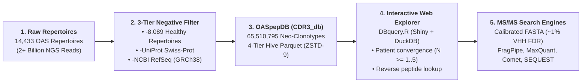
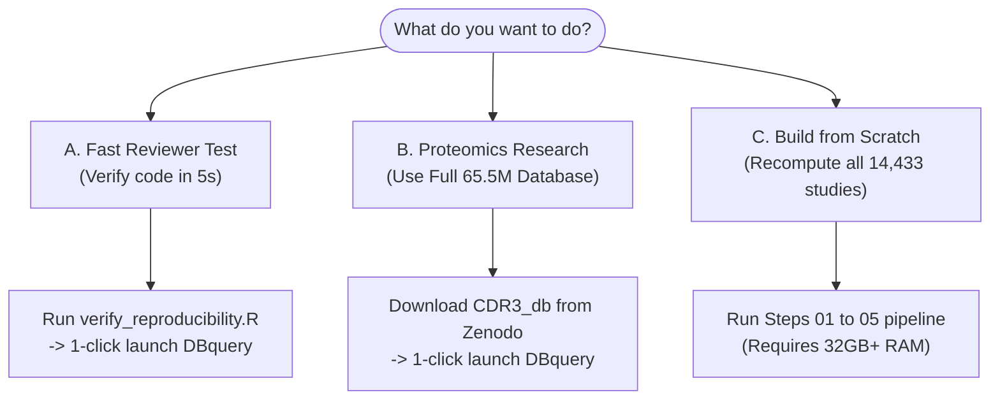

# OASpepDB: Human Disease CDR3 Antibody Peptides Database

[](LICENSE)
[](https://www.r-project.org/)
[](https://www.python.org/)
[](https://duckdb.org/)
[](https://doi.org/10.5281/zenodo.10561456)

A curated repository of **65,510,795** non-redundant, **disease-exclusive antibody CDR3 peptides** across **25 human disease cohorts**, engineered specifically for bottom-up immunoproteomics and liquid chromatography–tandem mass spectrometry (LC-MS/MS) database searching.

---

### Key Metrics at a Glance

| 25 Disease Cohorts | 65.5M Peptides | 3-Tier Negative Filter | Sub-0.05s Query Speed |
| :---: | :---: | :---: | :---: |
| COVID-19, CLL, HIV, SLE, Asthma, MS, Celiac... | Non-redundant CDR3 micro-cassettes | Healthy controls + Human Swiss-Prot/RefSeq subtracted | In-memory DuckDB OLAP on 4-tier Hive Parquet |

---

## 1. How OASpepDB Works (Graphical Abstract)


```mermaid
flowchart LR
    A["<b>1. Raw Repertoires</b><br/>14,433 OAS Repertoires<br/>(2+ Billion NGS Reads)"] --> B["<b>2. 3-Tier Negative Filter</b><br/>• -8,089 Healthy Repertoires<br/>• -UniProt Swiss-Prot<br/>• -NCBI RefSeq (GRCh38)"]
    B --> C["<b>3. OASpepDB (CDR3_db)</b><br/>65,510,795 Neo-Clonotypes<br/>4-Tier Hive Parquet (ZSTD-9)"]
    C --> D["<b>4. Interactive Web Explorer</b><br/>DBquery.R (Shiny + DuckDB)<br/>• Patient convergence (N >= 1..5)<br/>• Reverse peptide lookup"]
    D --> E["<b>5. MS/MS Search Engines</b><br/>Calibrated FASTA (~1% VHH FDR)<br/>FragPipe, MaxQuant, Comet, SEQUEST"]
```

---

## 2. Quick Start: Choose Your Workflow

Depending on your objective, choose one of the three paths below:


```mermaid
graph TD
    Start([What do you want to do?]) --> ChoiceA["A. Fast Reviewer Test<br/>(Verify code in 5s)"]
    Start --> ChoiceB["B. Proteomics Research<br/>(Use Full 65.5M Database)"]
    Start --> ChoiceC["C. Build from Scratch<br/>(Recompute all 14,433 studies)"]
    
    ChoiceA --> ActA["Run verify_reproducibility.R<br/>-> 1-click launch DBquery"]
    ChoiceB --> ActB["Download CDR3_db from Zenodo<br/>-> 1-click launch DBquery"]
    ChoiceC --> ActC["Run Steps 01 to 05 pipeline<br/>(Requires 32GB+ RAM)"]
```

### Option A: Instant Demo & Reproducibility Check (Recommended for Reviewers, ~5s)
Verify the entire pipeline end-to-end from scratch ($0) with 8 curated repertoires (~15 KB total):
```bash
# 1. Clone repository
git clone https://github.com/SDU-Immunoinformatics/SDU_Immunoinformatics.git
cd SDU_Immunoinformatics

# 2. Run automated self-check (downloads demo data, builds DB, tests DuckDB)
Rscript OASpepDB/scripts/verify_reproducibility.R

# 3. Launch interactive web app
# Windows: Double-click OASpepDB/DBquery-Windows.bat
# Linux:   bash OASpepDB/DBquery-Linux.sh
# macOS:   bash OASpepDB/DBquery-Mac.command
```

---

### Option B: Use Full Pre-compiled Database (Recommended for Proteomics Researchers)
If you want to immediately query, analyze, and export search-ready FASTA databases across the entire **65.5 million peptides (all 25 cohorts)** without spending hours downloading and re-computing:

1. **Download the pre-compiled database** from **Zenodo** (*DOI: [10.5281/zenodo.10561456](https://doi.org/10.5281/zenodo.10561456)*, ~18 GB compressed).
2. **Extract the archive** to the repository root as `CDR3_db/` (or place it at `D:/OAS/unpaired/CDR3_db`).
3. **Launch the Web App**:
   - **Windows**: Double-click `OASpepDB/DBquery-Windows.bat`
   - **Linux**: `bash OASpepDB/DBquery-Linux.sh`
   - **macOS**: `bash OASpepDB/DBquery-Mac.command`
   *(Or click the **"Load DB"** button inside the app to select any custom folder where you unzipped the database).*

---

### Option C: Recompute Full Database from Scratch (For Developers / HPC)
To re-process all 14,433 OAS studies from raw FASTQ/CSV streams on your own workstation or cluster, see the [Detailed Pipeline Guide](#detailed-pipeline-execution-from-scratch) below.

---

## 3. Interactive Web Application (`DBquery.R`)

The built-in web application connects an in-memory **DuckDB OLAP engine** to the Hive-partitioned Parquet database for sub-second exploration and export:

1. **Cohort Stratification Dashboard**:
   - Interactive **Alluvial diagram** visualizing clonal flow across clinical categories, cohorts, tissue sources (PBMC, Tonsil, Spleen), B-cell types (Memory, Naive, Plasma), and isotypes (IgG, IgA, IgM, IgE, Light).
   - **Clonal Stringency Filters**: Threshold by minimum patient sharing ($N \ge 1, 2, 3, 5$) to identify convergent public antibodies, and minimum read depth ($Redundancy \ge 1, 5, 10, 50$).
2. **Search-Ready Proteomics Export**:
   - Exports `OAS_<Disease>_<Date>.fasta` containing minimal-flank micro-cassettes, common laboratory contaminants ([cRAP](https://www.thegpm.org/crap/)), and auto-scaled ~1% non-human Camelid VHH entrapment controls ($I \rightarrow L$ converted) for empirical target-decoy false discovery rate (FDR) validation.
   - Also exports analysis-ready `.parquet` tables and `.txt` query audit manifests.
3. **Reverse Peptide Lookup**:
   - Paste any identified experimental tryptic peptide sequence (e.g. from FragPipe, MaxQuant, or Mascot) to instantly identify its parent clonotype, disease specificity, isotype, and patient recurrence.

---

## 4. Cohort Distribution Summary (25 Clinical Cohorts)

| Clinical Category | Disease Cohorts Included | Non-Redundant CDR3 Peptides |
| :--- | :--- | :--- |
| **Infectious Diseases** | COVID-19, HIV, CMV-EBV, Influenza, Sepsis, RSV, West Nile, Dengue, Ebola, Hepatitis B, Cholera, Rotavirus, Enterovirus, Lyme, S. pneumoniae, C. difficile | **39,400,000+** |
| **Allergy & Airways** | Allergy-SIT, Allergy-NoSIT, Asthma | **8,900,000+** |
| **Autoimmune & Neuro** | SLE (Lupus), Multiple Sclerosis, Rheumatoid Arthritis, Myasthenia Gravis | **13,300,000+** |
| **Hematology & Tumors** | CLL (Chronic Lymphocytic Leukemia), Melanoma | **3,900,000+** |
| **Total Database** | **25 Human Disease Cohorts** | **65,510,795** |

---

## 5. Technical Details & Advanced Pipeline

<details>
<summary><b>▶ Click to expand Step-by-Step Pipeline & Architecture (Full Reproduction)</b></summary>

### System Hardware Requirements

| Configuration | CPU Cores | RAM | Free Disk Space | Runtime |
| :--- | :---: | :---: | :---: | :---: |
| **Demo Mode (Option A)** | Any (>= 2 cores) | >= 4 GB | < 100 MB | ~5 seconds |
| **Full Build (Option C)** | >= 8 cores (16 rec.) | >= 32 GB | >= 200 GB SSD | ~3–5 hours |

### Repository Structure

```text
SDU_Immunoinformatics/
├── OASpepDB/
│   ├── DBquery.R                           # Interactive Shiny web app (DuckDB OLAP)
│   ├── DBquery-Windows.bat                 # 1-click launcher for Windows
│   ├── DBquery-Mac.command                 # 1-click launcher for macOS
│   ├── DBquery-Linux.sh                    # 1-click launcher for Linux
│   ├── data/
│   │   ├── OAS_metadata.csv                # Curated master catalog (14,433 studies, 3.77 MB)
│   │   ├── cRAP.fasta                      # Common mass spec contaminant reference
│   │   ├── entrapment_cassettes.fasta      # Camelid VHH entrapment controls for empirical FDR
│   │   ├── demo_download_human_unpaired.sh # Lightweight demo downloader (~15 KB)
│   │   └── bulk_download_human_unpaired.sh # Full production downloader (14,433 studies)
│   └── scripts/
│       ├── 01_download_OAS.py              # Step 01: Streaming download & biological QC trimming
│       ├── 02_build_healthy_cdr3_cache.py  # Step 02: PyArrow SIMD healthy CDR3 indexer
│       ├── 03_insilico_digest.R            # Step 03: Human proteome in silico tryptic digest
│       ├── 04_build_disease_db.py          # Step 04: Disease-exclusive Hive database builder
│       ├── 05_fetch_ncbi_entrapment.py     # Step 05: NCBI Entrez Camelid VHH harvester
│       ├── download_reference_proteomes.py # UniProt & RefSeq proteome fetcher
│       ├── generate_unified_alluvial_svg.R # Dynamic alluvial diagram generator
│       └── verify_reproducibility.R        # Automated zero-state self-check script
├── requirements.txt                        # Python dependencies
├── LICENSE                                 # MIT License
└── Readme.md                               # Project documentation
```

### Detailed Pipeline Execution (From Scratch)

```bash
# Prerequisites
pip install -r requirements.txt
R -e "install.packages(c('shiny','bslib','DT','duckdb','DBI','arrow','ggplot2','plotly','dplyr','htmlwidgets','zip'), repos='https://cloud.r-project.org')"

# Step 01: Stream & Trim Repertoires
# (Use demo_download_human_unpaired.sh for Demo or bulk_download_human_unpaired.sh for Full)
python OASpepDB/scripts/01_download_OAS.py \
    --sh OASpepDB/data/bulk_download_human_unpaired.sh \
    --out-dir OAS_raw --threads 8

# Step 02: Index Healthy Control CDR3 Cache (Tier-1 Subtraction)
python OASpepDB/scripts/02_build_healthy_cdr3_cache.py \
    --metadata OASpepDB/data/OAS_metadata.csv \
    --data-dir OAS_raw \
    --out-parquet CDR3_db/healthy_cdr3_cache.parquet \
    --workers 16

# Step 03: Digest Human Reference Proteomes (Tier-2 & Tier-3 Subtraction)
python OASpepDB/scripts/download_reference_proteomes.py
Rscript OASpepDB/scripts/03_insilico_digest.R

# Step 04: Construct Disease-Exclusive Hive Database
python OASpepDB/scripts/04_build_disease_db.py \
    --metadata OASpepDB/data/OAS_metadata.csv \
    --data-dir OAS_raw \
    --healthy-cache CDR3_db/healthy_cdr3_cache.parquet \
    --negative-ref OASpepDB/data/negative_human_reference_peptides.parquet \
    --out-dir CDR3_db --workers 8

# Step 05: Harvest Camelid VHH Entrapment Controls
python OASpepDB/scripts/05_fetch_ncbi_entrapment.py --target-count 2000
```

### Biological & Mass Spectrometry Engineering Principles

1. **Minimal-Flank Micro-Cassette Construction**:
   $$\text{Micro-Cassette} = [\text{Minimal\_FR3\_Flank}] + [\text{CDR3}] + [\text{FR4}] + [\text{Isotype\_Tail}]$$
   Eliminates redundant upstream Framework 3 tryptic sites to prevent false-positive framework PSMs while preserving the conserved C104 anchor and terminal constant domain cleavage (`+ASTK` for IgG/IgM/Bulk, `+ASPTSPK` for IgA, `+GQPK` for Lambda, native terminus for Kappa).
2. **Proteolytic Cleavage Calibration**:
   Tryptic digestion strictly follows Keil rules ($[KR](?!P)$). CDR3-bearing peptides are filtered for mass spectrometry proteotypic lengths (7–40 aa) and hypervariable core overlap ($\ge 5$ aa).
3. **Calibrated Empirical FDR Control**:
   Authentic non-human Camelid VHH sequences with isobaric $I \rightarrow L$ mutations are automatically spiked into exported FASTA databases at $\sim 1\%$ to provide an empirical negative benchmark during database searching.

</details>

---

## 6. Citation & Data Availability

* **Pre-compiled Parquet Database**: Archived on **Zenodo** (*DOI: [10.5281/zenodo.10561456](https://doi.org/10.5281/zenodo.10561456)*).
* **Reference Annotations & Catalogs**: Available under [`OASpepDB/data/`](OASpepDB/data/).
* **Raw Repertoire Data**: Publicly hosted by the [Observed Antibody Space](https://opig.stats.ox.ac.uk/webapps/oas/).

```bibtex
@article{OASpepDB2026,
  title   = {OASpepDB: A Curated Disease-Exclusive Antibody CDR3 Database for High-Throughput Immunoproteomics},
  author  = {SDU Immunoinformatics Group},
  journal = {Preprint / Under Review},
  year    = {2026},
  doi     = {10.5281/zenodo.10561456}
}
```
