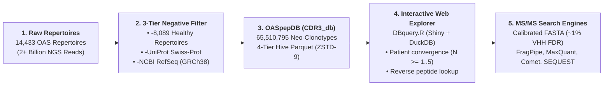

# OASpepDB: Human Disease CDR3 Antibody Peptides Database

A curated repository of **65,510,795** non-redundant, **disease-associated antibody CDR3 peptides** across **25 human disease cohorts**, engineered specifically for bottom-up immunoproteomics and liquid chromatography–tandem mass spectrometry (LC-MS/MS) database searching.

---

## 1. How to use this database

For proteomics researchers who want to search, explore, and export search-ready databases across **all 25 disease cohorts (65.5 million peptides)** without needing to recompute from raw NGS reads:

### Step 1: Download the Pre-compiled Database from Zenodo
Download the complete partitioned database archive from **Zenodo** (*DOI: [10.5281/zenodo.10561456](https://doi.org/10.5281/zenodo.10561456)*, ~18 GB compressed Parquet):
1. Extract the downloaded `CDR3_db` archive directly into the repository root as `CDR3_db/` (or place it at any custom path, e.g., `D:/OAS/unpaired/CDR3_db`).

### Step 2: Launch `DBquery.R`
Launch the standalone web application using the 1-click launcher for your operating system:
* **Windows**: Double-click `OASpepDB/DBquery-Windows.bat`
* **Linux**: Run `bash OASpepDB/DBquery-Linux.sh`
* **macOS**: Double-click `OASpepDB/DBquery-Mac.command`
* **Or via R command**: `Rscript -e "shiny::runApp('OASpepDB/DBquery.R', launch.browser = TRUE)"`

*(If you unzipped the database into a custom folder, simply click the **"Load DB"** button in the app interface to select your directory).*

### Step 3: Explore and Export Data for Proteomics Analysis
* **Cohort Stratification Dashboard**: Filter by disease, isotype (IgG, IgA, IgM, IgE, Light), tissue source (PBMC, Tonsil, Spleen), and minimum patient sharing ($N \ge 1, 2, 3, 5$) to isolate high-confidence public antibody clonotypes.
* **Calibrated Proteomics Export**: Click **"Download FASTA"** to generate `OAS_<Disease>_<Date>.fasta` ready for search engines (FragPipe, MaxQuant, Comet, Mascot). The exported file automatically integrates minimal-flank micro-cassettes, common laboratory contaminants ([cRAP](https://www.thegpm.org/crap/)), and auto-scaled ~1% non-human Camelid VHH entrapment controls ($I \rightarrow L$ converted) for empirical false discovery rate (FDR) validation.
* **Reverse Peptide Lookup**: Paste experimental tryptic peptides identified by mass spectrometry to instantly reveal their matching clonotypes, disease specificity, isotype, and patient recurrence.

---

## 2. How OASpepDB was built and how to reproduce it

### Workflow Architecture

```mermaid
flowchart LR
    A["<b>1. Raw Repertoires</b><br/>14,433 OAS Repertoires<br/>(2+ Billion NGS Reads)"] --> B["<b>2. 3-Tier Negative Filter</b><br/>• -8,089 Healthy Repertoires<br/>• -UniProt Swiss-Prot<br/>• -NCBI RefSeq (GRCh38)"]
    B --> C["<b>3. OASpepDB (CDR3_db)</b><br/>65,510,795 Neo-Clonotypes<br/>4-Tier Hive Parquet (ZSTD-9)"]
    C --> D["<b>4. Interactive Web Explorer</b><br/>DBquery.R (Shiny + DuckDB)<br/>• Patient convergence (N >= 1..5)<br/>• Reverse peptide lookup"]
    D --> E["<b>5. MS/MS Search Engines</b><br/>Calibrated FASTA (~1% VHH FDR)<br/>FragPipe, MaxQuant, Comet, SEQUEST"]
```

### Option A: Reproduce Demo Database (Recommended for Reviewers, ~5 seconds)
Execute the complete end-to-end pipeline from scratch ($0) using 8 curated OAS repertoires (~15 KB total) covering Healthy controls and 3 disease cohorts (CLL, COVID-19, HIV):

```bash
# 1. Clone repository
git clone https://github.com/SDU-Immunoinformatics/SDU_Immunoinformatics.git
cd SDU_Immunoinformatics

# 2. Run automated zero-state verification
Rscript OASpepDB/scripts/verify_reproducibility.R

# 3. Launch Web App to inspect generated demo cohorts
# Windows: Double-click OASpepDB/DBquery-Windows.bat
# Linux:   bash OASpepDB/DBquery-Linux.sh
# macOS:   bash OASpepDB/DBquery-Mac.command
```

### Option B: Reproduce Full Production Database (All 14,433 OAS Repertoires)
To re-process all 14,433 unpaired human repertoire datasets from raw streams across all 25 disease cohorts (requires $\ge 32$ GB RAM, 8–16 CPU cores, and $\ge 200$ GB SSD space):

```bash
# Prerequisites
pip install -r requirements.txt
R -e "install.packages(c('shiny','bslib','DT','duckdb','DBI','arrow','ggplot2','plotly','dplyr','htmlwidgets','zip'), repos='https://cloud.r-project.org')"

# Step 01: Stream & Trim all 14,433 OAS repertoires
python OASpepDB/scripts/01_download_OAS.py \
    --sh OASpepDB/data/bulk_download_human_unpaired.sh \
    --out-dir OAS_raw --threads 8

# Step 02: Build Tier-1 Healthy Control Cache (8,089 healthy repertoires)
python OASpepDB/scripts/02_build_healthy_cdr3_cache.py \
    --metadata OASpepDB/data/OAS_metadata.csv \
    --data-dir OAS_raw \
    --out-parquet CDR3_db/healthy_cdr3_cache.parquet --workers 16

# Step 03: Human Reference Proteome Digestion (Tier-2 & Tier-3 Subtraction)
python OASpepDB/scripts/download_reference_proteomes.py
Rscript OASpepDB/scripts/03_insilico_digest.R

# Step 04: Build 4-Tier Hive Disease-Exclusive Parquet Database
python OASpepDB/scripts/04_build_disease_db.py \
    --metadata OASpepDB/data/OAS_metadata.csv \
    --data-dir OAS_raw \
    --healthy-cache CDR3_db/healthy_cdr3_cache.parquet \
    --negative-ref OASpepDB/data/negative_human_reference_peptides.parquet \
    --out-dir CDR3_db --workers 8

# Step 05: Harvest Camelid VHH Entrapment Controls
python OASpepDB/scripts/05_fetch_ncbi_entrapment.py --target-count 2000
```

---

## 3. Data Availability

* **Pre-compiled Parquet Database**: Archived on **Zenodo** (*DOI: [10.5281/zenodo.10561456](https://doi.org/10.5281/zenodo.10561456)*).
* **Reference Annotations & Catalogs**: Available under [`OASpepDB/data/`](OASpepDB/data/).
* **Raw Repertoire Data**: Publicly hosted by the [Observed Antibody Space](https://opig.stats.ox.ac.uk/webapps/oas/).
