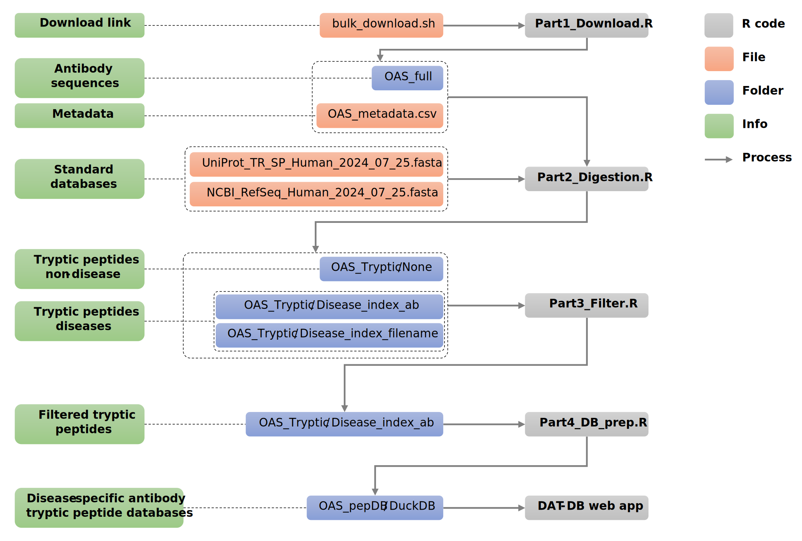

Data mining antibody sequences for database searching in bottom-up proteomics ================

## 0. Introduction

Human antibodies, vital components of the immune system, are protein molecules composed of two heavy and two light polypeptide chains, interconnected by disulfide bonds. These antibodies play a critical role in immune defense by recognizing and neutralizing pathogens. Identifying disease-specific antibodies is essential for diagnosing infectious diseases, evaluating vaccine effectiveness, and determining an individual's immune status. However, the human body can produce billions of unique antibodies, making their identification in complex biological samples, such as blood plasma, a considerable challenge.

Mass spectrometry (MS)-based proteomics is a powerful method for identifying and quantifying antibodies. Among the various MS approaches, bottom-up proteomics is especially effective for analyzing thousands of antibodies in complex mixtures. In this method, proteins are enzymatically digested into smaller peptides, typically using the protease trypsin, which are then analyzed via mass spectrometry. These peptides are matched to sequences in standard databases like UniProt or NCBI-RefSeq for identification.

However, a major limitation of this approach is the absence of comprehensive disease-specific antibody databases. Current databases, such as UniProt, include only a fraction of the antibody sequences present in the human body. For instance, as of January 2024, UniProt contains just 38,800 immunoglobulin sequences, far short of the billions of antibodies the human immune system can produce. As a result, relying on such limited databases can lead to under-detection of antibodies, particularly those associated with specific diseases. Expanding antibody databases with disease-specific sequences is crucial for improving the accuracy of MS-based proteomics in identifying antibodies relevant to human health.

Recently, through next-generation sequencing of antibody gene repertoires, it has become possible to obtain billions of antibody sequences (in amino acid format) by annotating, translating, and numbering antibody gene sequences. These large numbers of sequences are now available in public databases such as the [Observed Antibody Space](https://opig.stats.ox.ac.uk/webapps/oas/). We hypothesize that using these theoretical antibody sequences as new databases for bottom-up proteomics could address the current lack of antibody coverage in standard databases.

The workflow below is for creating disease-specific antibody tryptic peptide databases to use in bottom-up proteomics. The workflow contains five steps: **Download**, **Digest**, **Filter**, **Prepare DB** and **Use**. For the first four steps, four R script files were prepared and used for each step, those files are available in `Databases-preparation` directory (`Part1_Download.R`, `Part2_Digestion.R`, `Part3_Filter.R`, `Part4_DB_prep.R`).

Before starting the workflow, we need to install necessary R packages by running the codes in the file `Part0_Install_Packages.R` in the `Databases-preparation` directory.



## 1. Downloading antibody sequence data

Firstly, human antibody sequences are downloaded from [Observed Antibody Space webpage](https://opig.stats.ox.ac.uk/webapps/oas/). Go to the website, choose **Unpaired Sequences**. In the box **Search OAS sequences by attribute**, choose Species: **human**, Chain: **heavy**, and click **Search**. Heavy chain is capable of generating much more junctional and combinatorial diversity than the light chain and is the major contributor to antigen binding [(Tizard 2023)](http://dx.doi.org/10.1016/B978-0-323-95219-4.00013-7). Therefore, heavy chains in unpaired sequences were focused. The search will yield **1,891,061,809** unique sequences from **69** studies as of September 2024. A shell-script with the commands to download all the antibody data files in this search will be available for download, this file is bulk_download.sh.

After getting the `bulk_dow`nl`oad.sh` file, we open the `Part1_Download.R` file and run R codes in it. This file will use links in `bulk_download.sh` file to download antibody data and their metadata. After finish running codes in this file, a metadata file named `OAS_metadata.csv` and a directory `OAS_full` containing 13,265 `csv.gz` files of antibody will be obtained. Each file in `OAS_full` directory is a data table with columns: `sequence_alignment_aa`, `v_call`, `d_call`, `j_call`, `cdr1_aa`, `cdr2_aa`, `cdr3_aa`, where `sequence_alignment_aa` is antibody sequence in amino acid format, `v_call`, `d_call`, `j_call` are V call, D call and J call of antibody, `cdr1_aa`, `cdr2_aa`, `cdr3_aa` are peptide sequences in amino acid format of CD1, 2, 3 regions of the antibody.

ndefinedwe need to prepare 3`files: bulk_dow`nl`oad.sh, NCBI_RefSeq_Human_2024_07_`25.fas`ta, and UniProt_TR_S`P_Human\_`2024_07_25.fasta`. For downloading The `bulk_download.sh` file was obtained from [Observed Antibody Space webpage](https://opig.stats.ox.ac.uk/webapps/oas/).

Herein, we adopted extensive collection of antibody sequences from [Observed Antibody Space](https://opig.stats.ox.ac.uk/webapps/oas/) for conducting efficient database searches in publicly available proteomics data with a focus on the SARS-CoV-2 disease. Thirty million heavy antibody sequences from 146 SARS-CoV-2 patients in the [Observed Antibody Space](https://opig.stats.ox.ac.uk/webapps/oas/) were *in silico* digested to obtain 18 million unique peptides. These peptides were then used to create six databases (DB1-DB6) for bottom-up proteomics. We used those databases for searching antibody peptides in publicly available SARS-CoV-2 human plasma samples in the Proteomics Identification Database (PRIDE), and we consistently found new antibody peptides in those samples. The database searching task was done by using [Fragpipe](https://fragpipe.nesvilab.org/) softwares.

Remaining content of this document is for creating those databases.

The antibody sequences (heavy chains) were downloaded from The Observed Antibody Space database ([OAS](https://opig.stats.ox.ac.uk/webapps/oas/oas_unpaired/)). In this study, we focus on antibodies of SARS-CoV-2, so we choose keywords as below:

| Keyword      | Note                                                                             | Value      |
|-------------|-----------------------------------------------|-------------|
| Species      | Species being sequenced                                                          | human      |
| BSource      | Organ or tissue from where the B-cells were collected                            | PBMC       |
| BType        | Type of B-cells                                                                  | \*         |
| Longitudinal | Indicating whether the study was carried out at several time points              | undefined  |
| Age          | Indicating whether the age of the individual was recorded                        | \*         |
| Disease      | Indicating whether the individual was diseased at the time of sequencing         | SARS-CoV-2 |
| Subject      | Indicating whether the sequences can be traced from particular individual        | defined    |
| Vaccine      | Indicating whether the individual was vaccinated                                 | None       |
| Chain        | Specifying heavy or light chain                                                  | Heavy      |
| Isotype      | Isotype of heavy chain if available (IgG, IgM, etc.), Bulk stands for unassigned | \*         |

**Table 1**. Keywords search in OAS database for SARS-CoV-2.

After choosing keywords and clicking Search button, the website will give us results: *Your search yielded 30,966,193 unique sequences from 9 studies… A shell-script with the commands to download all the data-units in this subset of OAS can be downloaded [here](blob:https://opig.stats.ox.ac.uk/e3480b42-4861-49e6-9b5d-e1852b32baa1).* We downloaded the shell-script file (`bulk_download.sh`) and saved it to the directory `Part1-Download-data`.

In order to download all data files, we use terminal (in Mac and Linux, in Windows we can use terminal of [WSL - Windows Subsystem for Linux](https://learn.microsoft.com/en-us/windows/wsl/)), navigate the terminal to where the `bulk_download.sh` file was saved and run the command:

``` bash
bash bulk_download.sh
```

There are total 990 data file and the size of all data is 13 GB.

## 2. Read antibody sequences data

In this part, we will read the downloaded data (`csv` format) and save it as `fasta` format (for later *in silico* digestion) and `feather` format (for later load and use). Full R code and metadata file for this part are saved in the folder `Part2-Read-csv-data` of this Github repository.

We will read 990 data files (`csv` format )with the size of 13GB. This task requires at least 32GB of RAM by using `fread` function of the `data.table` package. For computers with less than 32GB of RAM, we recommend to use `diskframe` package as below (the data will be read from and saved to the hard disk, bypassing storage in RAM to prevent overloading the computer’s memory). After reading the whole `csv` data, we save it as feather format (feather format is designed to make reading and writing big data frames efficient).

After running the below code, we obtain a feather file containing 30,966,193 antibody sequences, the file is named as `OAS-SARS-COV2_Antibodies_2023-05-15.feather` and available at [Zenodo](https://doi.org/10.5281/zenodo.10566370).

``` r
library(svDialogs)
library(dplyr)
library(disk.frame)
library(data.table)
library(feather)
library(fst)
library(readxl)
setup_disk.frame()
options(future.globals.maxSize = Inf)

# Choose data folder
DataFolder <- dlg_dir(title = "Select csv data folder:", filters = dlg_filters[c("All"), ])$res

# Get list of data files
DataFiles <- list.files(path = DataFolder, pattern = ".csv.gz", all.files = FALSE, 
                        full.names = TRUE, recursive = TRUE, ignore.case = FALSE, 
                        include.dirs = FALSE, no.. = FALSE)

# Read metadata file (OAS-SARS-COV-2-summary.csv) and add columns Filename and PatientID
DataSummary <- read.csv(file = dlg_open(title = c("Select metadata file ", "OAS-SARS-COV-2-summary.csv:"), filters = dlg_filters[c("All"), ])$res,
                        header = T)
DataSummary$Filename <- basename(DataSummary$DownloadLink)
DataSummary$PatientID <- paste(DataSummary$DS.Name, DataSummary$Individual, sep = "_")

# Set folder for saving data
#setwd(dlg_dir(title = "Select where to save data:", filters = dlg_filters[c("All"), ])$res)


# Assign a temporary folder to save disk frame data
tempFolder <- dlg_dir(title = "Select temporory folder to save disk frame:", filters = dlg_filters[c("All"), ])$res
setwd(tempFolder)

# Read each csv file, save them as a list of diskframes to tempFolder
 Listdata <- lapply(c(1:length(DataFiles)), function(i){
 dat <- csv_to_disk.frame(
    DataFilesFilter[i], 
    outdir = file.path(paste(tempFolder, "/tmp_",i, sep = "")),
    nchunks = 60,
    overwrite = T)
})

# Combine list of disk.frames together into one big diskframe
 OAS_Abs <- rbindlist.disk.frame(Listdata,
                                  outdir = (paste(tempFolder, "/OAS-SARS-COV2_Antibodies", sep = "")),
                                  overwrite = T,
                                  by_chunk_id = TRUE,
                                  parallel = TRUE)

# Load OAS data that was saved in hard disk:
# OAS_Abs <- disk.frame(dlg_dir(title = "Select disk frame data folder:", filters = dlg_filters[c("All"), ])$res)

# Check column names and row number of OAS_Abs
OAS_colnames <- colnames(OAS_Abs); OAS_colnames
nrow(OAS_Abs)

# Extract some important columns in OAS_Abs (because the whole OAS_Abs data is very large to read in RAM, so we just take some columns)
Datatable  <- OAS_Abs %>% select(sequence_alignment_aa,
                                 v_call,
                                 d_call,
                                 j_call,
                                 fwr1_aa,
                                 cdr1_aa,
                                 fwr2_aa,
                                 cdr2_aa,
                                 fwr3_aa,
                                 cdr3_aa,
                                 fwr4_aa) %>%
                                collect
# Add AntibodyID column
Datatable$AntibodyID <- c(1:nrow(OAS_Abs))

# Make a vector of Data file names that match the file names of each csv data
Datafilename <- lapply(c(1:length(DataFiles)), function(i){
  rep(basename(DataFiles[i]), DataSummary$Unique.Sequences[DataSummary$Filename==basename(DataFiles[i])])
})
# Add data file name to Datatable of antibodies
Datatable$Datafilename <- unlist(Datafilename)

# Correct v_call column: remove any character after *
Datatable$v_call <- gsub("\\*.*","", Datatable$v_call)

# Save data to feather file
write_feather(Datatable, paste(tempFolder,"/OAS-SARS-COV2_Antibodies_", Sys.Date(), ".feather", sep = ""))
```

Save antibody sequences to `fasta` format (the `fasta` file that authors made is named as `OAS-SARS-COV2_Antibodies_2023-05-15.fasta` and available at [Zenodo](https://doi.org/10.5281/zenodo.10566370)):

``` r
# Save antibody sequences to fasta file

# Extract antibody sequences
Sequences <- as.list(c(Datatable$sequence_alignment_aa))

# Get data file names (without extension)
NameList <- strtrim(Datatable$Datafilename, nchar(as.character(Datatable$Datafilename))-7)

# Make sequence names
Nameseq <- c(paste(NameList, Datatable$AntibodyID, sep = "__"))
                
# Save data to fasta file
library(seqinr)
write.fasta(Sequences,   # sequences
            Nameseq, # name of sequences
            paste(dirname(tempFolder),"/OAS-SARS-COV2_Antibodies_", Sys.Date(), ".fasta", sep = ""), # location to save fasta file  
            open = "w", nbchar = 60, as.string = TRUE)
```

## 3. *In silico* digestion of antibody sequences

We use [Protein Digestion Simulator](https://github.com/PNNL-Comp-Mass-Spec/Protein-Digestion-Simulator) software for *in silico* digestion of antibody sequences. Input file for *in silico* digestion is the `fasta` file that we obtained above. The digestion settings were: fully tryptic (KR not P), max missed cleavages of 0, minimum fragment mass of 400, and maximum fragment mass of 6000. After the digestion of 30,966,193 antibody sequences, we obtain a text file of 18,419,969 distinct trypic peptides. The digestion of 42,421 protein sequences of UniProt gave 691,027 distinct peptides.

## 4. Filtering peptides

In this part, we read the file containing digested peptides above (`OAS-SARS-COV2_digested_2023-05-15.txt`) and filter remove peptides which are duplicated with petides in UniProt database. The `txt` file is big data (20GB), so we use `diskframe` package to read and extract data from it. After this step, we obtain a `feather` file containing OAS antibody peptides (`OAS-SARS-COV2_peptides_non-UniProt_2023-05-16.feather` which is available at [Zenodo](https://doi.org/10.5281/zenodo.10566370)).

``` r
library(svDialogs)
library(feather)
library(data.table)
library(dplyr)
library(disk.frame)
library(stringr)
library(tidyverse)
library(ggplot2)
library(gtools)
library(scales)
library(gridExtra)
library(openxlsx)
setup_disk.frame()
options(future.globals.maxSize = Inf)

SaveFolder <- dlg_dir(title = "Select Save folder:", filters = dlg_filters[c("All"), ])$res
setwd(SaveFolder)
# Load file OAS-SARS-COV-2-summary.csv
DataInfo <- fread("OAS-SARS-COV-2-summary.csv", header = T)
DataInfo$Filename <- strtrim(basename(DataInfo$DownloadLink), nchar(basename(DataInfo$DownloadLink))-7)

# Read digested OAS data. This is a large data (217 millions peptide sequences), RAM memory may not be sufficient so we use disk.frame package to load data into hard disk instead of RAM.
# Replace "D:/Diskframe/OAS-SARS-COV2_Antibodies_digested" with your file location
OAS_digested <- csv_to_disk.frame(
  "OAS-SARS-COV2_digested_2023-05-15.txt", 
  outdir = file.path("D:/Diskframe/OAS-SARS-COV2_Antibodies_digested"),
  nchunks = 60,
  overwrite = T)

# If we loaded/saved data before, then we read the saved data:
# OAS_digested <- disk.frame("D:/Diskframe/OAS-SARS-COV2_Antibodies_digested")

# Read UNIPROT human data
UNIPROTdata <- fread("UNIPROT_isoform_human_digested.txt", header = T)
print(paste("Number of peptides in UNIPROT = ", nrow(UNIPROTdata)))
print(paste("Number of DIFFERENT peptides in UNIPROT = ", length(unique(UNIPROTdata$Sequence))))

# Collect peptide sequences in OASdata_digested:
OAS1  <- OAS_digested %>% 
  select(Protein_Name, Sequence) %>% 
  collect
print(paste("Number of peptides in OAS-SARS-COV-2 = ", nrow(OAS1)))
print(paste("Number of DIFFERENT peptides in OAS-SARS-COV-2 = ", uniqueN(OAS1$Sequence)))


# Find common sequences in OAS and UNIPROT, and extract OAS data which are not in UNIPROT:
a <- Reduce(intersect, list(OAS1$Sequence, UNIPROTdata$Sequence))
OAS1 <- OAS1[!(OAS1$Sequence %in% a), ]
print(paste("Number of peptides in OAS-SARS-COV-2 and not in UNIPROT = ", nrow(OAS1)))
print(paste("Number of DIFFERENT peptides in OAS-SARS-COV-2 and not in UNIPROT = ", length(unique(OAS1$Sequence))))

# Add DataID column (indicate samples SRA - Data file name, extract all characters before "__"):
OAS1$DataID <- gsub("\\__.*","", OAS1$Protein_Name)

# Add AntibodyID column (Get characters after "__" and convert them to numbers)
OAS1$AntibodyID <- as.numeric(gsub(".*__","", OAS1$Protein_Name))

# Remove the Protein_Name column
OAS1 <- OAS1[,-c("Protein_Name")]; head(OAS1)

# Add BioProject and PatientID columns:
BioProject <- DataInfo %>% select("DS.Name", "Individual", "Filename")
colnames(BioProject) <- c("BioProject", "Individual", "DataID")
BioProject$PatientID <- paste(BioProject$BioProject, BioProject$Individual, sep = "_")
BioProject <- BioProject[,-c("Individual")]
# join 2 data to get BioProject and Patient info
OAS1 <- left_join(x = OAS1, y = BioProject, by = c("DataID"="DataID")); head(OAS1)

# Remove PatientID  having less than 100 peptides
PatientIDfreq <- as.data.table(table(OAS1$PatientID)); colnames(PatientIDfreq) <- c("PatientID", "Freq")
PatientList <- PatientIDfreq$PatientID[PatientIDfreq$Freq > 100]
OAS1  <- OAS1[OAS1$PatientID %in% PatientList,]

# Add v_call (variable gene) column:
OAS_Antibodies <- as.data.table(read_feather(dlg_open(title = "Select Save folder:", filters = dlg_filters[c("All"), ])$res))
#OAS_Antibodies <- as.data.table(read_feather("OAS-SARS-COV2_Antibodies_2023-05-15.feather"))
v_call <- as.data.table(OAS_Antibodies[,c("v_call", "AntibodyID")])
OAS1 <- as.data.table(OAS1)
OAS1 <- merge.data.table(OAS1, v_call, by = "AntibodyID"); OAS1
write_feather(OAS1, paste("OAS-SARS-COV2_peptides_non-UniProt_", Sys.Date(), ".feather", sep = ""))
```

## 5. Creating databases for bottom-up proteomics

Run the below codes for creating 6 databases (DB1-6) for later use in bottom-up proteomics. We made those database available at [Zenodo](https://doi.org/10.5281/zenodo.10566370).

``` r
library(svDialogs)
library(openxlsx)
library(readxl)
library(data.table)
library(phylotools)
library(stringr)
library(tidyr)
library(ggplot2)
library(tidyverse)
library(feather)
library(seqinr)
library(stringi)


#-------------------------------------------------------------------------------
SaveFolder <- dlg_dir(title = "Select Save folder:", filters = dlg_filters[c("All"), ])$res
setwd(SaveFolder)

# Read summary file and columns Filename and PatientID
DataSummary <- read.csv(file = "OAS-SARS-COV-2-summary.csv", header = T)
DataSummary$Filename <- basename(DataSummary$DownloadLink)
DataSummary$PatientID <- paste(DataSummary$DS.Name, DataSummary$Individual, sep = "_")

# Read OAS antibody data 
#OAS_antibodies <- as.data.table(read_feather("OAS-SARS-COV2_Antibodies_2023-05-15.feather")); OAS_antibodies

# Read filtered OAS peptide data 
OAS_pep <- as.data.table(read_feather("OAS-SARS-COV2_peptides_non-UniProt_2023-05-16.feather")); OAS_pep

# Total number of antibodies
N_Abs <- uniqueN(OAS_pep$AntibodyID); N_Abs

# Get prequency of peptides in OAS_pep
Table1 <- OAS_pep[, .N , by = Sequence]
colnames(Table1) <- c("Sequence", "No.Abs")
Table1 <- Table1[order(Table1$No.Abs, decreasing=T), ]
Table1$Percent <- round(Table1$No.Abs/N_Abs*100, 6); Table1


Top_pep <- c(100, 10^3, 10^4, 10^5, 10^6, 10^7)


# Check antibody coverage for top peptides
No_Abs_DBs <- sapply(c(1:length(Top_pep)), function(i){
  uniqueN(OAS_pep$AntibodyID[ OAS_pep$Sequence %in% Table1$Sequence[c(1:Top_pep[i])] ] )
})

Table2 <- data.table("DBs"        = c("DB1", "DB2", "DB3", "DB4", "DB5", "DB6"),
                     "OAS_pep_no" = Top_pep, 
                     "Abs_no"     = No_Abs_DBs,
                     "Abs_pct"    = round(No_Abs_DBs/N_Abs*100,3))

write.csv(Table2, file = "DBs-antibody-coverage.csv", row.names = F)


# Extract top peptides and Write fasta files
for (i in c(1:length(Top_pep))) {
  DB <- Table1[c(1:Top_pep[i]),]
  
  # Save peptide sequences to fasta file
  Sequences <- DB$Sequence
  # Get list of peptides and replace I to L (Isoleucine and Leucine have same mass)
  Sequences <- as.list(gsub("I", "L", c(Sequences)))
  
  NameList <- paste("Pep_", c(1:length(Sequences)), sep = "")
  
  Nameseq <- c(paste("sp|", "OAS_antibody_pep_", c(1:length(Sequences)), "|", sep = ""))
  
  # Save data to fasta file
  write.fasta(Sequences,   # sequences
              Nameseq, # name of sequences
              paste("OAS_",i,"_", Sys.Date(), ".fasta", sep = ""), # location to save fasta file  
              open = "w", nbchar = 60, as.string = TRUE)
  
}


#-------------------------------------------------------------------------------
# Combine fasta files (our peptide list and contaminants) together
# Go to Terminal, go to folder containing DB1.fasta, cRAP.fasta, and UNIPROT_includeIsoform_2023.03.03.fasta, run below command
cat *.fasta > DB1.fasta
# Repeat it for other databases DB2-6
```
